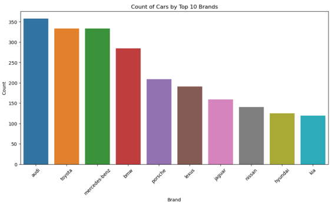

# 🚗 Car Data Insights: Price, Performance, and Market Dynamics

 **🔍 Objective**: Analyze 6,000+ car listings to uncover  trends related to pricing, 
performance, and global automotive market dynamics.

---

## **📈 🚗 Problem Statement**: Decoding Automotive Market Trends Through Data

The automotive industry’s pricing and performance metrics are influenced by complex factors like engineering specs (e.g., horsepower, engine capacity), brand reputation, and regional market dynamics. While vast amounts of car listing data exist, there’s a gap in:

-**Actionable Insights**: Linking technical specs to real-world pricing trends.

-**Market Segmentation**: Understanding how brands/countries position vehicles 	(e.g., budget vs. luxury).

-**Performance-Price Trade-offs**: Identifying whether higher engine power or speed justifies price premiums.

---

## **Outcome** : A data-driven guide for stakeholders (buyers, manufacturers, dealers) to navigate pricing, performance, and market positioning.
---

## 📂 Dataset Overview

This dataset includes **6,308 entries** with **9 object-type columns**, each representing a key attribute of a car:

- **Car Name**: Model identifier
- **Price**: Vehicle price (currency unspecified)
- **Engine Capacity**: Engine displacement in liters or cc
- **Cylinder**: Number of engine cylinders (some missing values)
- **Horsepower**: Power output
- **Top Speed**: Maximum speed
- **Seats**: Seating capacity
- **Brand**: Manufacturer name
- **Country**: Manufacturer's country of origin

---

## 📊 Visualizations & Learning Objectives

### 1. 🏢 Count of Cars by Top 10 Brands
- **Objective**: Identify market dominance by brand
- **Insights**: Determine which brands have the most car models in the dataset
- **Visual**:
- 
### 2. 💰 Top 10 Cars by Average Price
- **Objective**: Discover the most expensive car models on average
- **Insights**: Understand luxury market leaders

### 3. 🌍 Top Speed Distribution by Country
- **Objective**: Compare vehicle performance across countries
- **Insights**: Identify median and outlier top speeds per region

### 4. ⚡ Price vs. Horsepower Relationship
- **Objective**: Analyze price-to-power correlation
- **Insights**:
  - Identify value outliers
  - Compare brand strategies

### 5. 🪑 Distribution of Seats
- **Objective**: Examine common seating configurations
- **Insights**: Highlight frequency of each seating capacity

---

## 🧠 Challenges & Learnings

- Handled missing values and standardized inconsistent formats.
- Explored outlier influence on pricing.
- Learned to design cleaner, context-rich visualizations for storytelling.

---

## 🔍 Future Work

- Investigate fuel type or mileage statistics (if available)
- Use clustering for car segmentation
- Clean and standardize missing values (e.g., cylinder data)
- Build a **price prediction model** using regression.
- Incorporate **fuel type**, **mileage**, and **emissions** if data allows.
- Cluster cars by segments (e.g., SUV vs. Sedan) using k-means or DBSCAN.

---

## 📎 Tools Used

- Python (Pandas, Matplotlib, Seaborn)
- Jupyter Notebook

---

## 🙏 Acknowledgments

Thank you for exploring this project. Stay tuned for further developments!

---
